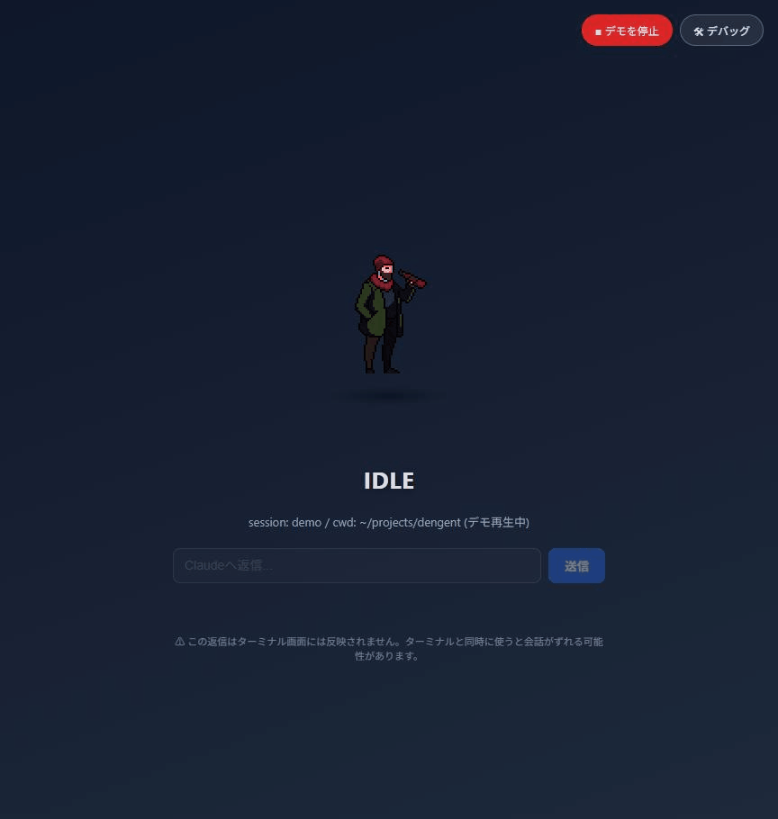

# dengent

複数のディレクトリで複数のAIコーディングエージェントを同時に起動・管理できる、ブラウザベースのランチャー。各セッションの作業状況（作業中／確認待ち／サブエージェント起動中）を2Dアバターとしてリアルタイムに可視化する。



## これは何か

Claude Codeにタスクを投げて別作業と並行させていると、「今ちゃんと動いているか」「確認待ちで止まっていないか」を確認するためだけにターミナルを何度も見に行くことになりがちです。さらに複数のディレクトリで複数のエージェントを並行稼働させたい場合、ターミナルウィンドウがいくつも並ぶだけで全体像を把握しづらくなります。

dengentはブラウザだけで完結するランチャーです。画面上のパネルにディレクトリと最初の指示を入力するだけでエージェントのセッションを開始でき、以降はカラムごとに独立したアバター・チャットログ・状態表示で並行管理できます。ターミナルを一切開かなくても、複数の作業ディレクトリのエージェントを同時に立ち上げて状況を一目で把握できることが最大の特徴です。

## 対応プロバイダ

- **Claude Code**：対応済み
- **Codex**：次のマイルストーンで着手予定（現状はUIの選択肢とエラーハンドリングのみ実装済み。選択すると「近日対応予定」の案内を返す）

## アーキテクチャ

```
ブラウザ（セッション開始パネル）
  → POST /start（ディレクトリ・プロバイダ・最初の指示を送信）
  → リレーサーバーが `claude --print` をヘッドレス起動
  → Claude Codeのhooks発火
      → hookクライアント（Node.js、stdinでJSON受信・非同期POST）
      → リレーサーバー（Express + ws、セッションごとに状態管理）
      → WebSocketで該当カラムへpush（トークン認証付き）
      → PixiJSでアバター描画
```

- **hookは絶対にClaude Code本体をブロックしない**設計（観測用フックに限る）。stdin受信からHTTP送信までを非同期化し、リレーサーバーが落ちていても300msでハード終了するタイムアウトを持たせている（実測パイプライン遅延：数ms〜数十ms）
- 状態はセッションID単位でサーバー側が`IDLE` / `WORKING` / `SUBAGENT_ACTIVE`（並行カウンター） / `WAITING_CONFIRMATION`のステートマシンとして管理し、1カラム＝1セッションとしてブラウザへ配信
- Free/Pro相当の表示制限を見据え、hooksは`~/.claude/settings.json`（ユーザーレベルのグローバル設定）に登録。ただしdengentが`/start`で起動したセッションだけを追跡し、それ以外（ターミナル等から起動された他のセッション）のイベントは完全に無視する
- アバター描画は[PixiJS](https://pixijs.com/)。DOM/フレームワークに依存しない疎結合モジュール（`public/avatar.js`）として実装し、公開APIは`setState` / `setSubagentCount` / `setCharacter` / `destroy`の4つだけ

## 技術的な工夫

- **ヘッドレス実行中のWrite/Edit/Bashをブラウザで許可/拒否**：`claude --print`はTTYが無く対話的な承認プロンプトを出せないため、標準では書き込み系ツールが実行不能になる。`PreToolUse`フック（`Write|Edit|Bash`にのみ発火）がリレーサーバーへ同期的にブロックするHTTPリクエストを送り、ブラウザでユーザーが許可/拒否を押すまでプロセスを待たせる方式で解決した。dengentが起動していないセッション（このdengentを開発しているセッション自身を含む）には即座に「対象外」を返して素通りさせるため、他のClaude Codeセッションを一切妨げない。ブラウザが未接続・再読み込み中に承認要求が発火した場合に備え、保留中のリクエストもセッション状態と同様に再接続時のスナップショットへ含めて復元する
- **セッション開始時のレース条件対策**：`launchId`をサーバーではなくブラウザ側で発行し、`/start`リクエスト送信前に同期的にカラムへ紐付けるようにした。サーバー側で発行する方式だと、HTTPレスポンスが届く前に実プロセスの`UserPromptSubmit`がWebSocket経由で先に届いてしまい、まだ紐付けの終わっていないカラムではなく新しい空カラムが作られてしまう不具合があった
- **同一ディレクトリでの多重起動を防止**：既に稼働中／起動中のセッションと同じディレクトリが指定された場合はサーバー側で`409`を返して拒否する
- **コマンドインジェクション対策**：ブラウザからの返信を`claude --resume`で送り込む機能があるが、`shell: true`を使うと自由入力テキストがそのままシェル文字列に連結される脆弱性があったため、Windowsの`.cmd`シムを解析して実体の`.exe`を直接起動する方式に変更（shellを一切介さない）
- **CSRF/盗聴対策**：ローカルサーバーとはいえ`127.0.0.1`宛のリクエストは任意のWebページから飛ばせてしまうため、サーバー起動ごとに発行するワンタイムトークンで`/start`・`/reply`・WebSocket接続を認証
- **同一セッションへの二重書き込み防止**：ターミナルが作業中の間にブラウザから返信を送ると会話ログが壊れるため、`IDLE`時のみ受付＋送信中ロックで排他制御
- **レイテンシの実測**：hookクライアント自身の処理時間とネットワーク遅延を分離して計測し、体感ではなく数値でボトルネックを追えるようにしている

## セットアップ

```bash
npm install
npm start
```

ブラウザで `http://127.0.0.1:4317/` を開くと、セッション開始パネルが表示されます。プロバイダ・ディレクトリ（📂ボタンで選択）・最初の指示を入力して「開始」を押すだけで、そのディレクトリに対するエージェントセッションがバックグラウンドで立ち上がります。セッションが増えるとカラムが自動で追加され、複数ディレクトリを並行して管理できます。

デバッグログ（hookイベントの生データ・レイテンシ計測）は `?debug=1` を付けるか、画面右上の「🛠 デバッグ」ボタンで表示できます。

## 使用アセット

キャラクターアバターは[CraftPix.net](https://craftpix.net/)の無料素材（[Free Homeless Character Sprite Sheets Pixel Art](https://craftpix.net/freebies/free-homeless-character-sprite-sheets-pixel-art/)）を使用。商用利用可・クレジット表記不要のライセンス（[craftpix.net/file-licenses](https://craftpix.net/file-licenses/)で確認済み）。Free版は3種類のアバターから選択可能。

## ステータス

コア体験のMVP化フェーズ進行中。Claude Codeでの複数ディレクトリ並行運用・ブラウザ承認フローまで実装済み。次のマイルストーンはCodexプロバイダの実装。
